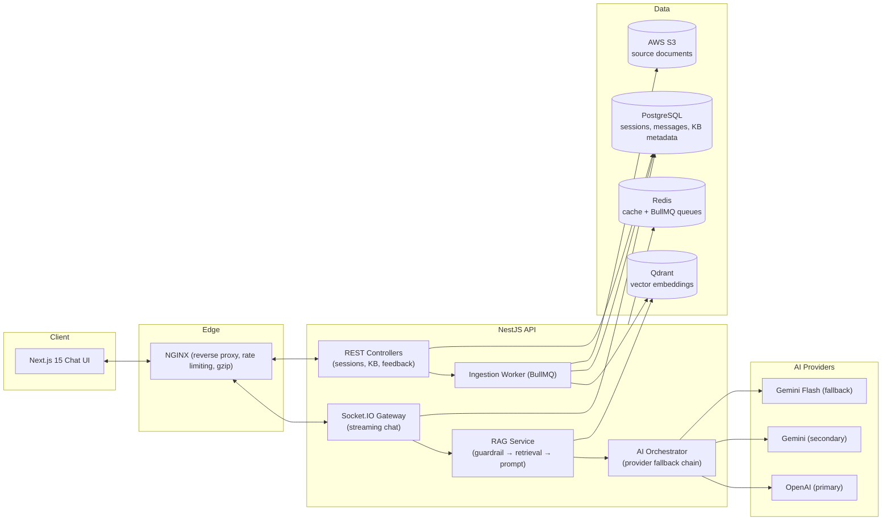

# Sabse Pehle Life Insurance AI Assistant

An enterprise RAG chatbot platform for [sabsepehlelifeinsurance.com](https://sabsepehlelifeinsurance.com) that answers
questions **only** about life insurance, health insurance, claims, premiums, tax benefits, riders,
IRDAI regulations, government insurance schemes, and the company's own products/FAQs — grounded
in a retrieved knowledge base, in the user's own language, with citations.

> **Status: Phase 1 of a phased build.** This phase delivers a real, production-quality,
> end-to-end core: streaming chat UI ↔ NestJS API ↔ RAG pipeline ↔ Postgres/Qdrant/Redis, fully
> dockerized. It does **not** yet include the admin panel, automated web crawler, analytics
> dashboards, or monitoring stack — see [Roadmap](#roadmap) for what's next and why those were
> sequenced later rather than stubbed out now.

---

## 1. Architecture



See [docs/architecture.md](docs/architecture.md) for the RAG pipeline, guardrail design, and AI
provider fallback semantics in detail. See [docs/api.md](docs/api.md) for the REST + Socket.IO
API reference.

### Monorepo layout

```
apps/
  api/              NestJS backend (REST + Socket.IO + RAG + ingestion worker)
  web/               Next.js 15 frontend (chat UI)
packages/
  shared-types/      Zod schemas + TS types shared by api and web (the API contract)
  config/            Shared tsconfig base
infra/
  nginx/             Reverse proxy config
docker-compose.yml   Full local stack: postgres, redis, qdrant, api, web, nginx
```

Turborepo orchestrates builds across the workspace; `packages/shared-types` is the single source
of truth for request/response shapes on both sides of the API.

---

## 2. Tech stack (Phase 1)

| Layer | Technology |
|---|---|
| Frontend | Next.js 15, React 19, TypeScript, Tailwind CSS, shadcn-style components, Framer Motion, TanStack Query, Socket.IO client, React Hook Form + Zod |
| Backend | NestJS, Socket.IO, REST, BullMQ, Redis, class-validator + Zod |
| Database | PostgreSQL via Prisma ORM |
| Vector DB | Qdrant (hybrid dense + keyword re-rank search) |
| Cache / Queue | Redis + BullMQ |
| Storage | AWS S3 (knowledge base source files) |
| AI | Pluggable provider layer — OpenAI (primary) → Gemini (secondary) → Gemini Flash (fallback), swappable via env vars only |
| Reverse proxy | NGINX (rate limiting, gzip, WebSocket upgrade) |
| Containers | Docker, Docker Compose (Kubernetes-ready structure) |
| CI | GitHub Actions (lint, typecheck, build, Docker image build) |

---

## 3. Getting started

### Prerequisites

- Node.js ≥ 20, npm ≥ 10
- Docker + Docker Compose (recommended path)
- An OpenAI API key and/or Gemini API key (at least one is required for the chatbot to answer)
- An AWS S3 bucket (only needed to upload PDFs/DOCX to the knowledge base)

### Option A — Docker Compose (recommended)

```bash
cp .env.example .env
# then fill in OPENAI_API_KEY / GEMINI_API_KEY and any AWS S3 credentials you have

docker compose up --build
```

This brings up Postgres, Redis, Qdrant, the API, the web app, and an NGINX reverse proxy.

- App: http://localhost
- API directly: http://localhost:4000/api
- Qdrant dashboard: http://localhost:6333/dashboard

On first boot, the API container's entrypoint runs `prisma migrate deploy` automatically.

### Option B — Local dev (no containers for app code, infra still via Docker)

```bash
cp .env.example .env   # fill in secrets

# Start only the data layer in Docker:
docker compose up -d postgres redis qdrant

# Install workspace deps
npm install

# Build the shared contract package once (dev servers rely on its compiled output)
npm run build --workspace=@sabsepehle/shared-types

# Run migrations
npm run prisma:migrate --workspace=@sabsepehle/api
npm run prisma:seed --workspace=@sabsepehle/api

# Start both apps in watch mode
npm run dev
```

- Web: http://localhost:3000
- API: http://localhost:4000/api

> Windows note: all npm scripts are written to be cross-platform (no bash-only `${VAR:-default}`
> substitutions) — they run identically under PowerShell/cmd and POSIX shells.

---

## 4. Production deployment

The monorepo splits cleanly into two deployable pieces — deploy them separately, they don't
need to live on the same platform.

### Frontend (`apps/web`) → Vercel

1. Import the repo in Vercel, set **Root Directory: `apps/web`**.
2. `package.json` in `apps/web` has a `vercel-build` script that builds `packages/shared-types`
   first via Turborepo — Vercel uses it automatically instead of the plain `build` script, so no
   extra build-command config is needed.
3. Set env vars in the Vercel project: `NEXT_PUBLIC_API_URL`, `NEXT_PUBLIC_SOCKET_URL` (your
   deployed API's public HTTPS URL), `NEXT_PUBLIC_GA_MEASUREMENT_ID` (optional).
4. Attach your custom domain, deploy.

### Backend (`apps/api`) → Railway (or Render/Fly.io — same Dockerfile works anywhere)

1. New service from the same repo. **Do not set a Root Directory** — leave it at the repo root.
   `railway.toml` at the repo root already points Railway at `apps/api/Dockerfile` with the build
   context kept at the root (required: the Dockerfile's `turbo prune` step needs the whole
   monorepo visible, not just `apps/api`).
2. Add managed Postgres and Redis from Railway's plugin catalog (or keep using external ones —
   `DATABASE_URL`/`REDIS_URL` are just connection strings, point them wherever).
3. Add Qdrant — easiest is [Qdrant Cloud](https://cloud.qdrant.io)'s free tier; set `QDRANT_URL`
   and `QDRANT_API_KEY`.
4. Set every var from `.env.example` in Railway's environment settings — **see the production
   checklist at the top of `.env.example`** before going live (rotate secrets, real CORS origins,
   `NODE_ENV=production`).
5. Railway auto-detects the health check at `/api/health` (already configured in `railway.toml`).
6. Migrations run automatically on container start via `apps/api/docker-entrypoint.sh`
   (`prisma migrate deploy`) — nothing manual needed after first deploy.

### Why not deploy the backend to Vercel too

Vercel is serverless — functions are short-lived and there's no persistent process. Two things
in this backend need exactly that:
- **Socket.IO** (streaming chat) needs a long-lived WebSocket connection, not a request/response
  function.
- **The BullMQ ingestion worker** (knowledge base processing, nightly crawler) needs an
  always-running process, not something invoked per-request.

Both work fine on Railway/Render/Fly.io/a VPS — anywhere that runs a persistent container.

### Scaling past one backend instance

If you run more than one API replica behind a load balancer, you need either sticky sessions on
the LB or the [Socket.IO Redis adapter](https://socket.io/docs/v4/redis-adapter/) — without one of
those, a client's WebSocket can land on a replica that doesn't have their session. Not needed at
one replica.

---

## 5. Environment variables

All variables are documented with defaults in [`.env.example`](.env.example). Key ones:

| Variable | Purpose |
|---|---|
| `AI_PRIMARY_PROVIDER`, `AI_SECONDARY_PROVIDER`, `AI_FALLBACK_PROVIDER` | Provider fallback chain order (`openai`, `gemini`, `gemini-flash`) |
| `OPENAI_API_KEY`, `OPENAI_CHAT_MODEL`, `OPENAI_EMBEDDING_MODEL` | OpenAI credentials/models. **The embedding model is fixed independently of the chat provider** — see [docs/architecture.md](docs/architecture.md#embedding-consistency) |
| `GEMINI_API_KEY`, `GEMINI_CHAT_MODEL`, `GEMINI_FLASH_MODEL` | Gemini credentials/models |
| `RAG_TOP_K`, `RAG_MIN_SIMILARITY`, `RAG_CHUNK_SIZE`, `RAG_CHUNK_OVERLAP` | Retrieval tuning |
| `DATABASE_URL`, `REDIS_URL`, `QDRANT_URL` | Data layer connections — point these at the bundled Docker services or at managed cloud instances, whichever you're running |
| `AWS_*` | S3 bucket for uploaded knowledge base source files |
| `JWT_SECRET`, `JWT_REFRESH_SECRET`, `COOKIE_SECRET` | Reserved for the Phase 2 admin panel's auth |
| `NEXT_PUBLIC_API_URL`, `NEXT_PUBLIC_SOCKET_URL` | Where the browser reaches the API (baked into the web build) |

**Switching AI providers requires only an env var change** (`AI_PRIMARY_PROVIDER=gemini`, etc.) —
no code changes. See `apps/api/src/ai-provider/`.

---

## 6. What's implemented in Phase 1

- **Streaming chat**: token-by-token via Socket.IO, Markdown + code blocks + tables, citations with
  source links and relevance scores, copy / regenerate / like / dislike, suggested questions,
  auto-scroll (that respects manual scroll-up), persistent sessions, share-by-link
  (`/c/[sessionId]`), export conversation to PDF, clear chat, light/dark mode.
- **RAG pipeline**: embed query → Qdrant similarity search (with keyword-overlap re-rank) → prompt
  builder → streamed completion → citations + confidence score returned to the client.
- **Domain guardrail**: keyword allow/deny lists + prompt-injection pattern detection +
  retrieval-confidence fallback — if nothing relevant is retrieved, the assistant declines instead
  of guessing (see [docs/architecture.md](docs/architecture.md#guardrail)).
- **AI provider layer**: OpenAI → Gemini → Gemini Flash fallback chain; a mid-stream failure is
  surfaced as an error rather than silently retried (would duplicate/garble already-rendered
  content).
- **Knowledge base ingestion**: upload PDF/DOCX/TXT/CSV or submit a URL → BullMQ job → extract →
  chunk → embed → upsert into Qdrant + Postgres metadata. Re-index and delete supported.
  (REST endpoints only for now — the admin UI for this lands in Phase 2.)
- **Multi-language**: the assistant detects and replies in whatever language the user writes in
  (native LLM capability, instructed via system prompt); `franc` tags the detected language on
  each message for analytics.
- **Security**: Helmet, CORS allowlist, Redis-backed rate limiting, Zod validation on every
  boundary, PII redaction utility for logs, prompt-injection pattern guardrail.
- **Anonymous visitor tracking**: cookie-less visitor id (localStorage) registered against the
  backend, session persistence across reloads.

## 7. Roadmap (not yet built)

Deliberately sequenced after a working core, so each phase ships fully implemented rather than
stubbed:

- **Phase 2** — Admin panel (dashboard, knowledge base CMS with chunk/embedding viewer, AI
  settings, prompt management, auth).
- **Phase 3** — Automated crawler (Playwright/Crawl4AI) with hourly/12-hourly schedulers for the
  company site and IRDAI.
- **Phase 4** — Analytics, GA4 event tracking, reports/exports.
- **Phase 5** — Full UI localization (100+ languages) and richer AI-settings admin surface.
- **Phase 6** — Prometheus/Grafana/Loki monitoring, Kubernetes manifests, hardened CI/CD.

---

## 8. Useful scripts

```bash
npm run dev          # turbo: run both apps in watch mode
npm run build         # turbo: build all workspaces
npm run lint           # turbo: lint all workspaces
npm run typecheck      # turbo: typecheck all workspaces

# Prisma (run from apps/api, or via --workspace=@sabsepehle/api)
npm run prisma:migrate --workspace=@sabsepehle/api   # create/apply a dev migration
npm run prisma:deploy --workspace=@sabsepehle/api    # apply migrations (prod)
npm run prisma:studio --workspace=@sabsepehle/api    # inspect the DB
npm run prisma:seed --workspace=@sabsepehle/api      # seed default AI settings row
```

## 9. License

Proprietary — Sabse Pehle Life Insurance. All rights reserved.
# life-insu

